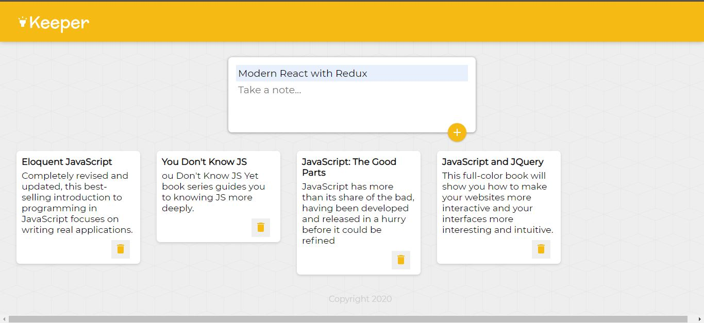

# Keeper 📒
Google keep clone.See preview from [here](https://68ee6.csb.app/)

## Screenshots
<p align="center">
    
</p>

## Tools & Languages
- React
- Materialui
- Transparent backgrounds

## Usage 
```bash
# Change directory to keeper folder
~ cd Keeper
# Install the dependencies
~ npm install
# Run app
~ npm start
```

## Key features
- React props
- React Hooks - useState
- Event Handling in React
- Changing Complex State
- Javascript ES6 Spread Operator
- Make styles & animations using Material UI

## Contributing
Pull requests are welcome feel free to ```fork``` this repo.

## License
This project is open-sourced under the [MIT license](https://opensource.org/licenses/MIT).